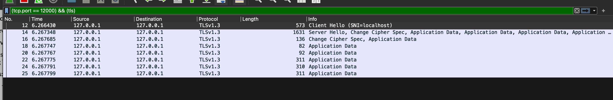
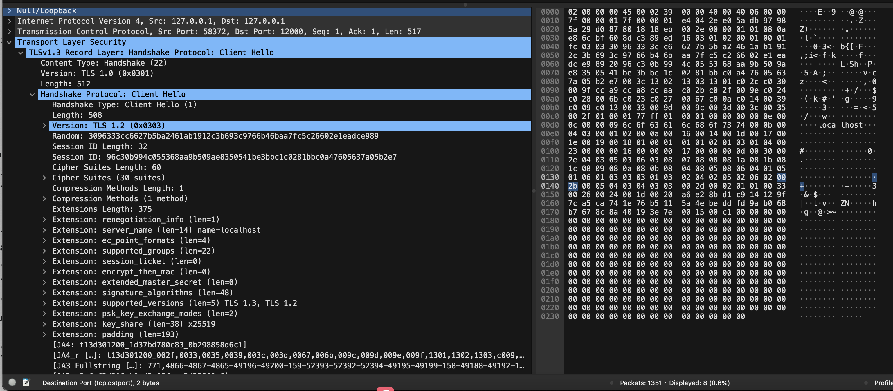
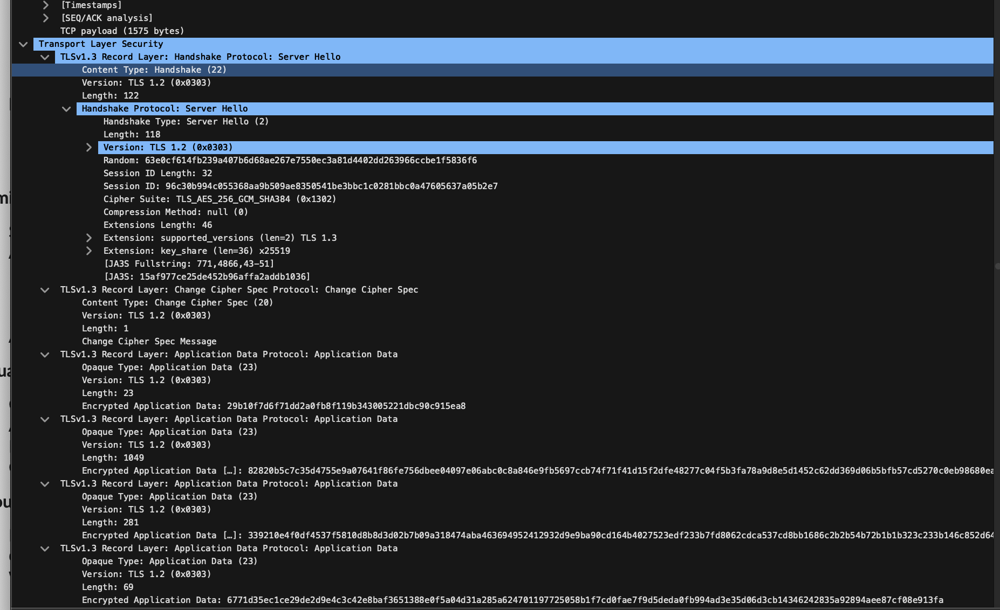
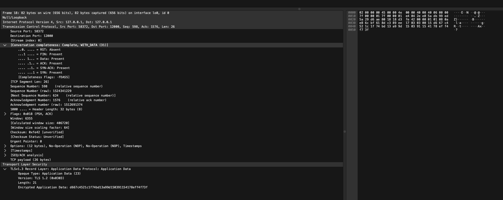

# TLS Programming Implementation and Analysis

This repository contains a secure file transfer implementation using TLS (Transport Layer Security), along with detailed analysis and documentation.

## Table of Contents
1. [Setup and Installation](#setup-and-installation)
2. [Implementation Overview](#implementation-overview)
3. [Network Analysis](#network-analysis)
4. [Certificate Management Reflection](#certificate-management-reflection)
5. [Best Practices and Security Considerations](#best-practices-and-security-considerations)

## Setup and Installation

### Prerequisites
- Python 3.x
- OpenSSL
- Wireshark (for traffic analysis)

### Setting Up the Environment

1. **Generate SSL Certificates**
```bash
openssl req -newkey rsa:2048 -new -nodes -x509 -days 3650 -keyout key.pem -out cert.pem
```

2. **Install Required Python Packages**
```bash
pip install ssl socket
```

3. **Directory Structure**
```
TLSProgrammingV2/
├── server/
│   ├── SecureNetFileXferServer.py
│   ├── cert.pem
│   └── key.pem
├── client/
│   └── SecureNetFileXferClient.py
└── README.md
```

### Running the Applications

1. **Start the Server**
```bash
cd server
python SecureNetFileXferServer.py <PORT>
```

2. **Run the Client**
```bash
cd client
python SecureNetFileXferClient.py <SERVER_IP> <PORT> <FILE_PATH>
```

## Implementation Overview

### Security Features

1. **TLS Implementation**
   - TLS 1.3 protocol
   - Strong cipher suites (AES-256-GCM)
   - Perfect Forward Secrecy
   - Certificate-based authentication

2. **Data Transfer Security**
   - Encrypted file transfer
   - Integrity verification
   - Secure connection handling
   - Error recovery mechanisms

### Code Structure

1. **Server Implementation**
```python
# Key security features in SecureNetFileXferServer.py
context = ssl.create_default_context(ssl.Purpose.CLIENT_AUTH)
context.load_cert_chain(certfile='cert.pem', keyfile='key.pem')
context.options |= ssl.OP_NO_TLSv1 | ssl.OP_NO_TLSv1_1  # Disable older TLS versions
context.set_ciphers('ECDHE-ECDSA-AES256-GCM-SHA384:ECDHE-RSA-AES256-GCM-SHA384')
```

2. **Client Implementation**
```python
# Key security features in SecureNetFileXferClient.py
context = ssl.create_default_context()
context.check_hostname = False  # For self-signed certificates
context.verify_mode = ssl.CERT_NONE  # For self-signed certificates
secure_socket = context.wrap_socket(client_socket, server_hostname=server_ip)
```

## Network Analysis

### TLS Handshake Analysis

1. **Initial Handshake**
   - Client Hello with supported cipher suites
   - Server Hello with selected cipher
   - Certificate exchange
   - Key exchange for Perfect Forward Secrecy

2. **Data Transfer**
   - Encrypted application data
   - TLS record structure
   - Secure connection closure

### Wireshark Capture Analysis

In Wireshark's filter bar, use this filter:
```
tls && tcp.port == <PORT>
```
In my example, the port is 12000.
```
(tcp.port == 12000) && (tls)
```




#### Packet Analysis: Client Hello (Packet #12)

**Size:** 573 bytes  
**Type:** Initial TLS Handshake

**Contents:**
- **Protocol Versions**
  - List of supported TLS versions
- **Cipher Configuration**
  - Available cipher suites
- **Server Identification**
  - SNI (Server Name Indication): "localhost"
- **Security Parameters**
  - Random nonce for session establishment
- **Protocol Features**
  - Supported TLS extensions


#### Packet Analysis: Server Hello (Packet #14)

**Size:** 1631 bytes  
**Type:** Server Response Bundle

**Contents:**
- **Protocol Selection**
  - Selected TLS version: TLSv1.3
  - Selected cipher suite: TLS_AES_256_GCM_SHA384
- **Authentication**
  - Server's certificate
  - Key exchange parameters
- **Handshake Completion**
  - Server's finished message


#### Packet Analysis: Change Cipher Spec (Packet #16)

**Size:** 136 bytes  
**Type:** Encryption Transition

**Contents:**
- **Security Confirmation**
  - Transition to encrypted communication
  - Negotiated parameters confirmation


#### Packet Analysis: Initial Data Transfer (Packet #18)

**Size:** 82 bytes (visible in "Frame 18: 82 bytes on wire")  
**Type:** TLSv1.3 Application Data (visible under "Transport Layer Security")

**Contents:**
- **TCP Payload:** 26 bytes
- **Transport Layer Security**
  - Opaque Type: Application Data (23)
  - Version: TLS 1.2 (0x0303)
  - Length: 21
  - Encrypted Application Data: d667c4521c1f74bd13a99d150391154178eff4f73f

#### Packet Analysis: File Transfer (Packets #20-25)

**Type:** Encrypted Application Data  
**Encryption:** TLS_AES_256_GCM_SHA384

**Packet Sizes:**
- 92 bytes
- 311 bytes
- 310 bytes
- 311 bytes

**Characteristics:**
- File contents split across multiple TLS records
- Consistent encryption across all packets
- Variable packet sizes for optimal transmission


## Certificate Management Reflection

### Role of Certificate Authorities (CAs)

1. **Primary Functions**
   - Identity verification
   - Certificate issuance
   - Trust chain establishment
   - Revocation management

2. **Certificate Validation Process**
   - Digital signature verification
   - Certificate properties validation
   - Revocation checking
   - Trust chain verification

### Self-Signed Certificates

1. **Advantages**
   - Quick deployment for development
   - No cost
   - Full control
   - Suitable for internal applications

2. **Disadvantages**
   - No third-party validation
   - Manual trust establishment
   - Browser warnings
   - Limited security guarantees

### Real-World Certificate Management

1. **Challenges**
   - Certificate lifecycle management
   - Private key security
   - Deployment automation
   - Compliance requirements

2. **Best Practices**
   - Regular rotation
   - Automated monitoring
   - Secure storage
   - Emergency procedures

## Best Practices and Security Considerations

### Implementation Best Practices

1. **TLS Configuration**
   - Use latest TLS version
   - Strong cipher suites
   - Perfect Forward Secrecy
   - Certificate validation

2. **Error Handling**
   - Secure error messages
   - Connection recovery
   - Resource cleanup
   - Timeout handling

### Production Deployment

1. **Security Measures**
   - Regular updates
   - Certificate monitoring
   - Access controls
   - Logging and auditing

2. **Maintenance**
   - Certificate renewal
   - Security patches
   - Performance monitoring
   - Incident response

## Future Considerations

1. **Emerging Technologies**
   - Quantum-safe cryptography
   - Automated certificate management
   - Enhanced security protocols
   - Zero-trust architectures

2. **Industry Trends**
   - Shorter certificate lifetimes
   - Increased automation
   - Stricter validation
   - Enhanced transparency

## Contributing

Please read CONTRIBUTING.md for details on our code of conduct and the process for submitting pull requests.

## License

This project is licensed under the MIT License - see the LICENSE.md file for details. 